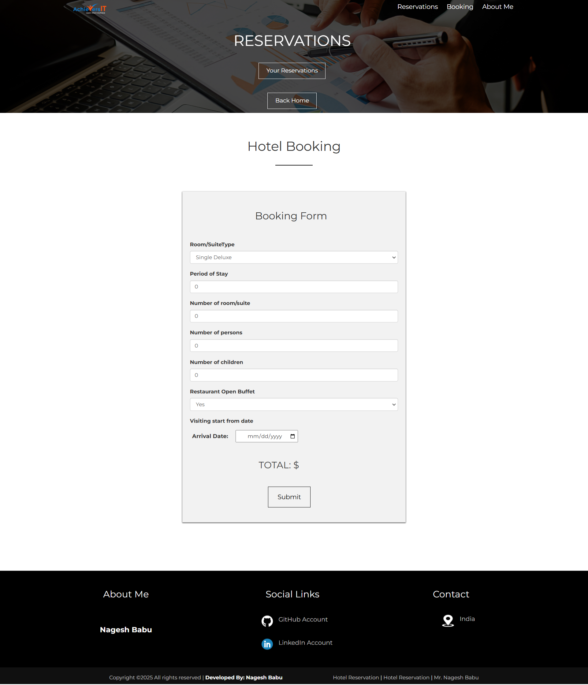
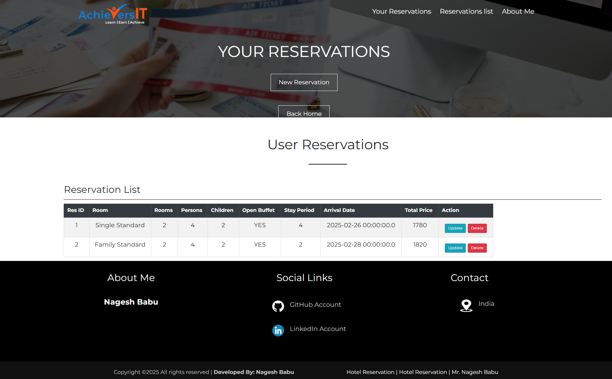

Java Spring Boot–based hotel booking web application enabling user registration, authentication, and reservation management. Supports room selection, stay duration, pricing calculation, and CRUD operations on bookings. Uses secure login, RESTful architecture, and database persistence for reliable reservation handling.

## Project Screenshots

### System Architecture

### Sign In Page

### Sign Up Page

### New Reservation Page

### Welcome Page

### Your Reservation Page

